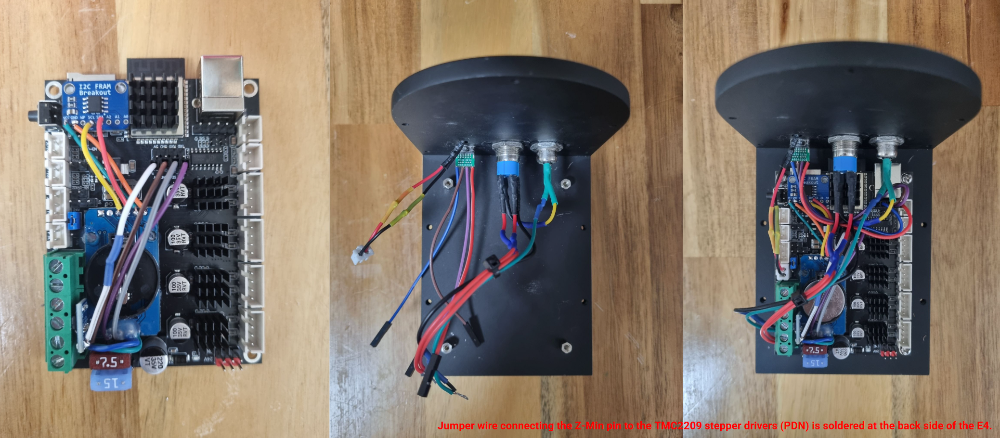
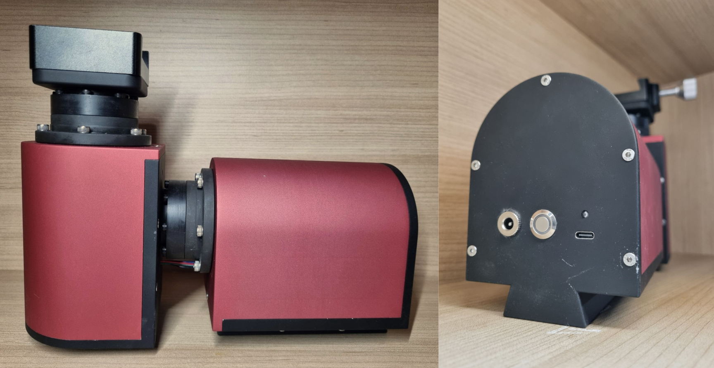

# Strain Wave Gear Equatorial Mount
## What is an equatorial mount?



An **equatorial mount** is a telescope mount designed to compensate for the Earth's rotation and track celestial objects as they move across the sky. It consists of two axes known as the **right ascension (RA)** and **declination (DEC)**.

The RA axis is aligned parallel to the Earth's rotational axis, allowing the mount to rotate at the same rate as the sky appears to move. By continuously rotating around the RA axis, the mount can effectively cancel out the Earth's rotation and keep a celestial object centered in the telescope's field of view.

The DEC axis is perpendicular to the RA axis and is used to adjust the telescope's position north or south of the celestial equator. By controlling both the RA and DEC axes, the mount can slew to a specific celestial coordinate and point the telescope at a desired object in the night sky. Once positioned, the RA axis can continue tracking the object as the Earth rotates.

## Comparison of Primary Reduction Gears

When building a strain wave gear equatorial mount yourself, one of the key decisions is which primary reduction gear to use. Each type of reduction gear has its own pros and cons, summarized in the table below.

| | Planetary gear | Belt drive | Direct drive (no reduction) | Strain wave gear |
|---|---|---|---|---|
| **Backlash** | Present | None | None | None |
| **Periodic error** | Small | Almost none | None | Somewhat present |
| **Maintenance** | Barely needed | Needed (tension adjustment) | Barely needed | Barely needed |

Although the third and fourth options are attractive for their low maintenance (requiring no tension adjustment over time) and zero-backlash design, I was unaware of their existence at the time.

## Features
* FRAM module saves current position every 1000ms from start-up (home position) enabling return if there is an accidental power outage (e.g., tripping over the power cable).
* RTC module keeps track of the current time and date even when the mount is turned off.
* High reduction ratio at 2000:1 eliminates the need for electromagnetic brakes.
* Supports pulse guiding via via USB-C (USB 2.0).
* Theoretical payload of 7kg without counterweight, 12kg with counterweight.

## Bill of materials
### BOM - Electronics
| Component | Price/unit (USD)* | Quantity |
|---|---|---|
| AMS1117-3.3 3PIN | $0.34 | 1 |
| USB Type-C Female Socket | $0.37 | 1 |
| DC-099 5.5x2.1mm Female Socket | $0.47 | 1 |
| 3φ 5V LED** | $0.48 | 1 |
| 40PCS 10cm female-to-female Dupont jumper wire | $0.89 | 1 |
| 40PCS 10cm female-to-male Dupont jumper wire | $0.94 | 1 |
| 40PCS 10cm male-to-male Dupont jumper wire | $1.04 | 1 |
| MB85RC256V I2C FRAM Memory Module | $2.96 | 1 |
| DS3231 RTC Module | $2.34 | 1 |
| 12mm push button with latching reset 9-30V(12V)** | $3.15 | 1 |
| 17HS4401 NEMA17 Stepper Motor | $4.66 | 2 |
| FLE42-L2SW (20:1) | $18.46 | 2 |
| FYSETC E4 | $26.34 | 1 |
| ZXS14 (100:1, for shaft diameter of 8mm) | $85.40 | 2 |

### BOM - Mechanical
| Component | Price/unit (USD) | Quantity |
|---|---|---|
| Phillips Round Head Screw, M3 x 3 | $0.02 | 4 |
| Hex Socket Countersunk Head Screw, M3 x 12 | $0.03 | 10 |
| Hex Socket Countersunk Head Screw, M3 x 15 | $0.03 | 8 |
| PCB Standoff, M3 x 5 | $0.05 | 4 |
| Hex Socket Countersunk Head Screw, M4 x 10 | $0.05 | 8 |
| Hex Socket Head Cap Screw, M4 x 12 | $0.05 | 3 |
| Hex Socket Countersunk Head Screw, M4 x 12 | $0.05 | 4 |
| Hex Socket Head Cap Screw, M4 x 20 | $0.06 | 12 |
| Hex Socket Head Cap Screw, M6 x 10 | $0.10 | 4 |
| Hex Socket Head Cap Screw, M4 x 18 | $0.10 | 6 |
| Dovetail holder | $12.95 | 1 |
| Super Lube MULTI-PURPOSE SYNTHETIC GREASE WITH SYNCOLON (PTFE) | $18.03 | 1 |
| Loctite 638 | $18.50 | 1 |
| CNC machined parts (6 in total, tariff excluded) | $639.31 | 1 |
| Heat shrink set | $2.66 | 1 |

| | Total |
|---|---|
| **Total BOM Cost (USD)** | $951.10 |

*Calculated based on the current (Sep 7th 2026) exchange rate of 1 KRW = $0.00074.  
**Emits red light.

## Code
I made several changes to the default [OnStepX-E4](https://github.com/hjd1964/OnStepX/tree/E4) code. 

```cpp
// Extra code added under #define STATUS_LED                     ON
#define STATUS_LED_ON_STATE          HIGH
```

```cpp
// This build does not utilize weather sensors of any sort.
#define WEATHER               OFF 
```

```cpp
// Positional memory retention via Adafruit MB85RC256V FRAM breakout (I2C).

#define NV_DRIVER      NV_MB85RC256
#define MOUNT_COORDS_MEMORY      ON
```

```cpp
// Relevant steps per degree was calculated here: http://www.stellarjourney.com/assets/downloads/OnStep%20Calculations%20134.xlsx

#define AXIS1_STEPS_PER_DEGREE      35555.55556
#define AXIS2_STEPS_PER_DEGREE      35555.55556
```

```cpp
// These options can be toggled ON and OFF for reversal of direction of rotation. 
// As you can see, my RA axis was somewhat rotating in the wrong direction.

#define AXIS1_REVERSE      ON
#define AXIS2_REVERSE      OFF
```

```cpp
// DS3231 settings were left at default. 
#define TIME_LOCATION_SOURCE       DS3231
```

```cpp
// Not a worm gear mount, fast guiding compensates for PE (Periodic Error)
#define PEC_STEPS_PER_WORM_ROTATION        0
```
```cpp
#define TRACK_AUTOSTART      ON
```

```cpp
// Although adjustable at run-time from 1/2 to 2x this rate, it is not recommended to go over 1.0 deg/sec as it may cause step-out.
#define SLEW_RATE_BASE_DESIRED        1.0

```

For uploading instructions, please refer to [OnStep Wiki](https://onstep.groups.io/g/main/wiki/32794). Although the wiki does not mention it explicitly, you will need to install the latest Adafruit BusIO library since this is a dependency for the Adafruit BME280 library (I have included ZIP files of [required libraries](./SW/Libraries/) inside the repository).

## Troubleshooting
### No response to serial commands (`:GVP#` returns nothing)
**Cause:** `NV_DRIVER` was set to `NV_MB85RC256` (external I2C FRAM) before the FRAM module was wired up. OnStepX hung indefinitely trying to write defaults to a non-existent NV device, so it never reached the point of starting the command channel.

**Fix:** Wire the FRAM to I2C before power-on, or temporarily switch `NV_DRIVER` to `NV_DEFAULT` (internal flash) if testing without it. After connecting/switching NV devices, run one `NV_WIPE ON` → upload → power cycle → wait ~1 min → `NV_WIPE OFF` → upload cycle to initialize the device's defaults.

### Status LED never lights
**Cause:** `STATUS_LED_PIN` on the E4 is routed through a MOSFET-switched fan header (V-Fan), which is active-HIGH. OnStepX's default LED logic assumes a raw cathode-sink pin (active-LOW), so it was driving the pin the opposite way needed to turn the LED on.

**Fix:** Add `#define STATUS_LED_ON_STATE HIGH` below `STATUS_LED ON` in Config.h.

### NINA shows ASCOM checksum / invalid drive rate errors
**Cause:** `DEBUG` was left set to `VERBOSE` in Extended_config.h. Since `SERIAL_DEBUG` shares the same physical port as the command channel (`SERIAL_A`), debug text was interleaved with LX200 protocol replies, corrupting what NINA received.

**Fix:** Set `DEBUG OFF` for normal operation; only enable `VERBOSE` for boot-log diagnostics with NINA disconnected.

### Status LED (and mount state) resets when opening the NINA OnStep Telescope Setup tab
**Cause:** ESP32 dev boards including the E4 have a built-in auto-reset circuit. The DTR and RTS lines from the USB-serial chip are wired through transistors to the ESP32's EN (reset) pin. This was originally intended to let the Arduino IDE reset the board automatically during firmware uploads. However, any application that opens the COM port, including NINA and ASCOM, can inadvertently trigger a reset. If RTS is held low while the port remains open, it can even keep the board in a reset state for the entire time the tab is open.

The behavior was inconsistent. Sometimes the LED would come back on after a full reboot cycle, but often it would never come back at all. This is likely caused by repeated connection retries reasserting DTR during the reboot process before the board has a chance to finish booting.

**Fix (soft and hard fixes):**
* In the ASCOM OnStep driver's Setup dialog, set the Serial Interface baud dropdown to the **"no DTR control"** variant. This does not prevent Status LED reset upon opening the NINA OnStep Telescope Setup tab, but makes sure the LED comes back on after a full reboot cycle.
* In Windows Device Manager → Ports → [COM port] → Properties → Port Settings → Advanced, enable **"Disable Modem Ctrl Handshaking."** This completely prevents Status LED reset.

### NINA's home position function does not work and GOTO function immediately settles
**Cause:** FRAM module is corrupt.

**Fix:** Replace FRAM.


### Mount behaves normally when the housing is not mounted, while it behaves abnormally when the housing is mounted
**Cause:** The reset switch on the board is physically pressed against the mount housing.

**Fix:** Trim off the end of the reset switch.

## Room for further improvement
* 3D print a non-metallic panel to provide easier access to the mount's power and control interfaces.

* Use a strain wave gear as the primary reducer instead of planetary gear to eliminate backlash while maintaining a high reduction ratio.

* Add a buzzer to provide audible feedback on the mount's status, making it possible to monitor its state without having to look at the mount.

* Add another opening for the onboard USB-B connector. It is structurally more rigid and can serve as a backup interface in the field if the USB-C port fails.
