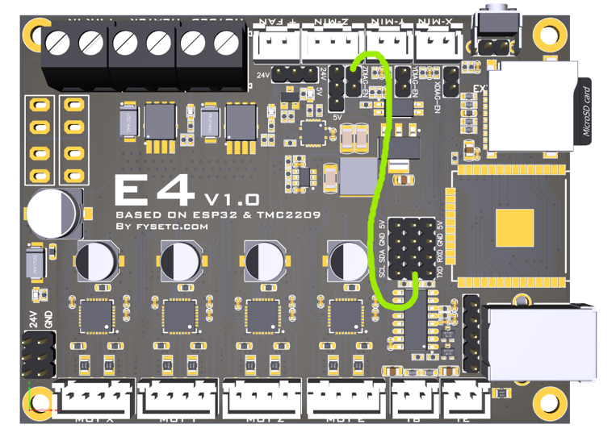

# Strain Wave Gear Equatorial Mount
## What is an equatorial mount?

.png)

.png)

An **equatorial mount** is a telescope mount designed to compensate for the Earth's rotation and track celestial objects as they move across the sky. It consists of two axes known as the **right ascension (RA)** and **declination (DEC)**.

RA axis is aligned parallel to the Earth's rotational axis, allowing the mount to rotate at the same rate as the sky appears to move. By continuously rotating around the RA axis, the mount can effectively cancel out the Earth's rotation and keep a celestial object centered in the telescope's field of view.

DEC axis is perpendicular to the RA axis and is used to adjust the telescope's position north or south of the celestial equator. By controlling both the RA and DEC axes, the mount can slew to a specific celestial coordinate and point the telescope at a desired object in the night sky. Once positioned, the RA axis can continue tracking the object as the Earth rotates.

## Comparison of Primary Reduction Gears

When building a strain wave gear equatorial mount yourself, one of the key decisions is which primary reduction gear to use. Each type of reduction gear has its own pros and cons, summarized in the table below.

| | Planetary gear | Belt drive | Direct drive (no reduction) | Strain wave gear |
|---|---|---|---|---|
| **Backlash** | Present | None | None | None |
| **Periodic error** | Small | Almost none | None | Somewhat present |
| **Maintenance** | Barely needed | Needed (tension adjustment) | Barely needed | Barely needed |

Although the third and fourth options are attractive for their sustainability (requiring no tension adjustment over time) and maintaining the zero-backlash nature of strain wave gears, I was unaware of their existence at the time.

## Features
* FRAM module tracks current position from start-up (home position) every 1000ms enabling return if there is an acciental power outage (e.g., tripping over the power cable).
* High reduction ratio at 2000:1 eliminates the need for electromagnetic brakes.
* Supports pulse guiding via USB-C 2.0.
* Theoretical payload of 7kg without counterweight, 12kg with counterweight.

## Bill of materials
### BOM - Electronics
| Component | Price/unit (USD)* | Quantity |
|---|---|---|
| AMS1117-3.3 3PIN | $0.34 | 1 |
| USB Type-C Female Socket | $0.37 | 1 |
| DC-099 5.5x2.1mm Female Socket | $0.47 | 1 |
| 3φ 5V LED** | $0.48 | 1 |
| 40PCS 10cm female-to-female Dupont jumper wire | $0.89 | 1 |
| 40PCS 10cm female-to-male Dupont jumper wire | $0.94 | 1 |
| 40PCS 10cm male-to-male Dupont jumper wire | $1.04 | 1 |
| MB85RC256V I2C FRAM Memory Module | $2.96 | 1 |
| 12mm push button with latching reset 9-30V(12V)** | $3.15 | 1 |
| 17HS4401 NEMA17 Stepper Motor | $4.66 | 2 |
| FLE42-L2SW (20:1) | $18.46 | 2 |
| FYSETC E4 | $26.34 | 1 |
| ZXS14 (100:1, for shaft diameter of 8mm) | $85.40 | 2 |

### BOM - Mechanical
| Component | Price/unit (USD) | Quantity |
|---|---|---|
| Phillips Round Head Screw, M3 x 3 | $0.02 | 4 |
| Hex Socket Countersunk Head Screw, M3 x 12 | $0.03 | 10 |
| Hex Socket Countersunk Head Screw, M3 x 15 | $0.03 | 8 |
| PCB Standoff, M3 x 5 | $0.05 | 4 |
| Hex Socket Countersunk Head Screw, M4 x 10 | $0.05 | 8 |
| Hex Socket Head Cap Screw, M4 x 12 | $0.05 | 3 |
| Hex Socket Countersunk Head Screw, M4 x 12 | $0.05 | 4 |
| Hex Socket Head Cap Screw, M4 x 20 | $0.06 | 12 |
| Hex Socket Head Cap Screw, M6 x 10 | $0.10 | 4 |
| Hex Socket Head Cap Screw, M4 x 18 | $0.10 | 6 |
| Dovetail holder | $12.95 | 1 |
| Super Lube MULTI-PURPOSE SYNTHETIC GREASE WITH SYNCOLON (PTFE) | $18.03 | 1 |
| Loctite 638 | $18.50 | 1 |
| CNC machined parts (6 in total, tariff excluded) | $639.31 | 1 |
| Heat shrink | N/A | N/A |

| | Total |
|---|---|
| **Total BOM Cost (USD)** | $946.14 |

*Calculated based on the current (Sep 7th 2026) exchange rate of 1 KRW = $0.00074.  
**Emits red light.

## Code
I made several changes in the provided code from the default [OnStepX-E4](https://github.com/hjd1964/OnStepX/tree/E4) code. 


```cpp
// Relevant steps per degree was calculated here: http://www.stellarjourney.com/assets/downloads/OnStep%20Calculations%20134.xlsx

#define AXIS1_STEPS_PER_DEGREE      35555.55556
#define AXIS2_STEPS_PER_DEGREE      35555.55556
```

```cpp
// Positional memory retention via Adafruit MB85RC256V FRAM breakout (I2C).

#define NV_DRIVER      NV_MB85RC256
#define MOUNT_COORDS_MEMORY      ON
```

```cpp
// These options can be toggled ON and OFF for reversal of direction of rotation. 
// As you can see, my DEC axis was somewhat rotating in the other direction.

#define AXIS1_REVERSE      OFF
#define AXIS2_REVERSE      ON
```

```cpp
#define TRACK_AUTOSTART      ON
```
Before uploading the code, make sure the E4 board looks exactly like the image below.



For uploading instructions, please refer to [OnStep Wiki](https://onstep.groups.io/g/main/wiki/32794). Although the wiki does not explicitly mention, you will need to install the lastest Adafruit BusIO library since this is a dependency for Adafruit BME280 library.